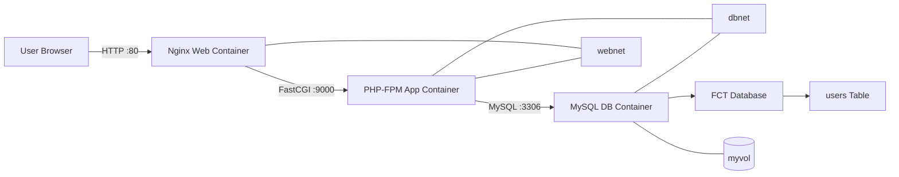

# Docker 3-Tier Web Application

A containerized 3-tier web application deployed on an AWS EC2 Docker host, demonstrating a classic **Nginx → PHP-FPM → MySQL** architecture using Docker Compose.

---

## Project Overview

This project implements a 3-tier web application using Docker Compose, where each tier runs in its own container:

- **Presentation Tier** — Nginx serves a static HTML form
- **Application Tier** — PHP-FPM processes form submissions
- **Data Tier** — MySQL stores submitted records

The containers communicate over Docker's internal networking using service names, and MySQL data is persisted using a named Docker volume so data survives container restarts.

---

## Architecture


```
User Browser
    |
    | HTTP :80
    v
Nginx Web Container
    |
    | FastCGI :9000
    v
PHP-FPM Application Container
    |
    | MySQL :3306
    v
MySQL Database Container
    |
    v
FCT Database
    |
    v
users Table
```

---

## Architecture Diagram



---

## Technologies Used

- **Docker** & **Docker Compose** — container orchestration
- **Nginx** — web server / reverse proxy to PHP-FPM
- **PHP-FPM** (`bitnami/php-fpm` image) — application runtime for processing form submissions
- **MySQL** — relational database
- **AWS EC2** — host environment for the Docker containers

---

## Project Structure

```
3-tier/
├── app/
│   └── code/
│       └── submit.php
├── db/
│   ├── Dockerfile
│   └── init.sql
├── web/
│   ├── code/
│   │   └── submit.html
│   └── config/
│       └── default.conf
└── docker-compose.yml
```

---

## How the 3-Tier Architecture Works

1. The user opens `submit.html` in their browser, served by the **Nginx** container over HTTP on port 80.
2. The user fills out the form (name, email, website, comment, gender) and submits it.
3. Nginx detects the `.php` request and forwards it to the **PHP-FPM** container over FastCGI on port 9000.
4. PHP-FPM executes `submit.php`, which connects to the **MySQL** container over port 3306 using the hostname `db`.
5. `submit.php` inserts the submitted form data into the `FCT.users` table.
6. On success, the application renders a confirmation page showing the submitted information.

---

## Docker Compose Services

The full `docker-compose.yml`:


```yaml
services:
  web:
    image: nginx
    ports:
      - "80:80"
    volumes:
      - ./web/code/:/usr/share/nginx/html/
      - ./web/config/:/etc/nginx/conf.d
    networks:
      - webnet
    depends_on:
      - app
      - db

  app:
    image: bitnami/php-fpm
    volumes:
      - ./app/code/:/app/
    networks:
      - webnet
      - dbnet
    depends_on:
      - db

  db:
    build: ./db/
    volumes:
      - myvol:/var/lib/mysql
    networks:
      - dbnet

volumes:
  myvol:

networks:
  webnet:
  dbnet:
```

### 1. `web` (Nginx)
- Uses the stock `nginx` image
- Publishes port `80` on the host, mapped to port `80` in the container
- Mounts `./web/code/` to `/usr/share/nginx/html/` — serves `submit.html` as a static file
- Mounts `./web/config/` to `/etc/nginx/conf.d` — supplies the custom Nginx server config (`default.conf`)
- Connected to `webnet`
- `depends_on: app, db` — ensures the `app` and `db` containers are started before `web`

### 2. `app` (PHP-FPM)
- Uses the `bitnami/php-fpm` image
- Runs `submit.php`
- Mounts `./app/code/` to `/app/` inside the container
- Connected to both `webnet` and `dbnet`
- Connects to MySQL using the hostname `db`
- `depends_on: db` — ensures `db` starts before `app`
- Exposes port `9000` internally only (no host port is published — it's reachable only from the `web` container via `webnet`)

### 3. `db` (MySQL)
- Built from the custom Dockerfile in `./db/`
- Environment: `MYSQL_ROOT_PASSWORD=root`, `MYSQL_DATABASE=FCT`
- `init.sql` is copied to `/docker-entrypoint-initdb.d/` and runs automatically on first container start
- Creates the `users` table
- Connected to `dbnet`
- Uses the persistent named volume `myvol`, mounted at `/var/lib/mysql`

---

## Docker Networking

Two isolated Docker networks are used to separate concerns and limit direct access to the database:

| Network | Connects | Purpose |
|---|---|---|
| `webnet` | Nginx ↔ PHP-FPM | Allows the web tier to forward requests to the application tier |
| `dbnet` | PHP-FPM ↔ MySQL | Allows the application tier to reach the database tier |

The Nginx container is **not** on `dbnet`, and the MySQL container is **not** on `webnet` — the `app` container is the only service with access to both networks, enforcing tier separation.

---

## Docker Volume / Persistent Storage

MySQL data is persisted using a named Docker volume:

```yaml
volumes:
  myvol:
```

This volume is mounted at `/var/lib/mysql` inside the `db` container, meaning database contents survive container restarts, recreation, or `docker-compose down` (unless the volume itself is explicitly removed with `-v`).

---

## Nginx + PHP-FPM Configuration

The key part of the Nginx configuration (`web/config/default.conf`) that connects the web tier to the application tier:

```nginx
location ~ \.php$ {
    include fastcgi_params;
    fastcgi_pass app:9000;
    fastcgi_index index.php;
    fastcgi_param SCRIPT_FILENAME /app$fastcgi_script_name;
}
```

**How it works:**
- Nginx serves `submit.html` directly as a static file.
- Any request matching `.php` is passed to PHP-FPM instead of being served directly.
- `fastcgi_pass app:9000` works because Docker Compose provides automatic service-name-based DNS resolution — `app` resolves to the PHP-FPM container's IP address within `webnet`.
- `SCRIPT_FILENAME /app$fastcgi_script_name` tells PHP-FPM the absolute path to the script to execute inside its own container filesystem — resolving to `/app/submit.php`, matching the code mounted into the `app` container.

---

## Database Initialization

**`db/Dockerfile`:**


**`db/init.sql`:**


MySQL automatically executes any `.sql` scripts placed in `/docker-entrypoint-initdb.d/` the first time the container initializes its data directory, which is how the `users` table is created without any manual setup.

**Database:** `FCT`
**Table:** `users`

| Column | Type | Description |
|---|---|---|
| `id` | `INT`, `PRIMARY KEY`, `AUTO_INCREMENT` | Unique record identifier |
| `name` | `VARCHAR(20)` | Submitted name |
| `email` | `VARCHAR(100)` | Submitted email |
| `website` | `VARCHAR(255)` | Submitted website URL |
| `gender` | `VARCHAR(6)` | Submitted gender |
| `comment` | `VARCHAR(100)` | Submitted comment |

Because `myvol` persists `/var/lib/mysql`, `init.sql` only runs on the *first* container start against a fresh volume — subsequent restarts reuse the existing data directory and do not re-run initialization.

---

## Application Flow

`submit.php` (application tier) performs the following:

1. Reads form fields from the POST request: `name`, `email`, `website`, `comment`, `gender`.
2. Connects to MySQL using:
   - **Host:** `db`
   - **Username:** `root`
   - **Password:** `root`
   - **Database:** `FCT`
3. Inserts the submitted data into `FCT.users`.
4. On success, renders a confirmation page echoing back the submitted information.

---

## How to Run the Project

```bash
# Clone the repository
git clone <your-repo-url>
cd 3-tier

# Build and start all containers
docker-compose up -d --build

# Verify containers are running
docker-compose ps
```

Once running, open the app in a browser:

```
http://<ec2-public-ip>/submit.html
```

---

## Useful Docker Commands

```bash
# View running containers
docker-compose ps

# View logs for a specific service
docker-compose logs web
docker-compose logs app
docker-compose logs db

# Rebuild and restart containers
docker-compose up -d --build

# Stop all containers
docker-compose down

# Stop containers and remove volumes (deletes DB data)
docker-compose down -v

# Access a shell inside a running container
docker exec -it <container_name> bash
```

---

## Database Verification Commands

```bash
# Access the MySQL container
docker exec -it <db_container_name> mysql -u root -p

# Inside MySQL shell
USE FCT;
SHOW TABLES;
SELECT * FROM users;
```

---

## Testing / Verification

**1. Stack rebuilt and containers verified via `docker compose down` / `docker compose up -d` / `docker ps`:**


All three containers (`3-tier-web-1`, `3-tier-app-1`, `3-tier-db-1`) start cleanly with the `3-tier_webnet` and `3-tier_dbnet` networks recreated, confirming the Compose stack comes up as designed. `web` publishes port `80` to the host; `app` and `db` remain internal-only, reachable solely through the Docker networks.

**2. Form submitted via `submit.html`:**


**3. Successful response returned by `submit.php`, echoing back the inserted record:**


This confirms the full request path worked as designed: **Browser → Nginx → PHP-FPM → MySQL → confirmation page.**

---

## Troubleshooting

| Issue | Likely Cause | Fix |
|---|---|---|
| 502 Bad Gateway | `app` container not running or Nginx can't reach it | Check `docker-compose ps` and `docker-compose logs app` |
| PHP file downloads instead of executing | `fastcgi_pass` misconfigured or `app` service not reachable | Verify `web` and `app` are both on `webnet` |
| "Connection refused" to MySQL | `db` container not ready yet or wrong hostname | Ensure PHP connects to host `db`, not `localhost`; wait for MySQL healthcheck/startup |
| Data missing after restart | Volume not used or removed with `-v` | Confirm `myvol` is defined and mounted at `/var/lib/mysql` |
| `init.sql` not applied | Volume already had existing data | Remove volume (`docker-compose down -v`) and restart to re-trigger initialization |

---

## Key Docker/DevOps Concepts Learned

- Multi-container application design using Docker Compose
- Separating an application into web, application, and data tiers
- Docker Compose service-name-based internal DNS resolution
- Configuring Nginx as a reverse proxy to PHP-FPM via FastCGI
- Isolating network access between tiers using multiple custom Docker networks
- Persisting stateful data (MySQL) using named Docker volumes
- Automatic database initialization via `docker-entrypoint-initdb.d`
- Deploying a multi-container Docker application on an AWS EC2 instance

---


